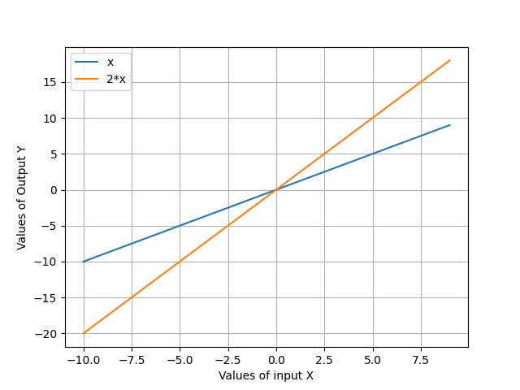

# Math 4610 Tasksheet 4

## Task 1
Create routines that compute the absolute error and relative error in approximating a number, x, with another number, y. 
Write two separate routines. The routines should be documented in your software manual and also include the production version of the code in your archive file.

### Solution
I created two routines built around the discussion on absolute and relative error in class. This resulted in a new java class for the .jar file, and two new methods, absErr and relErr. These are shown below
            
            public double absErr(double x, double y)
            {
                  double ret = (x-y)/x;
                  return Math.abs(ret);
            }
            
            public double relErr(double aprime, double ah, double a, double h)
            {
                  double ret = ((aprime - ((ah - a)/h))/a);
                  return Math.abs(ret);
            }
                 
To test them to see if they worked, I ran the code with the approximation and 'exact value' of f(x)=e^(2x). The results are here:

            The Absolute Error of e^(2*x) is: 2.818014964607709E-16
            The Relative Error of e^(2*x) is: 4.999995000024013

### Sources and Software Manual Pages
[absErr Software Manual Page]()

[relErr Software Manual Page]()

[absErr code]()

[relErr code]()

## Task 2
Create a graphics routine that will create a 2D plot of data that includes the following.

      Graph string expressions in a Python module.
      Include a loop to graph multiple expressions for comparison.
      Use different colors for the graphs of the functions.
      Hardcode axes labels.
      Do note include a title for the graph.
      Include a legend for the curves.
      
If you are working mostly in Python you can choose to include the module in your archive. If you are not coding primarily in Python, you should make sure you document this in your software manual as an extra code.

### Solution
I worked with a string list inputted by the user. The stop, start and step size is hardcoded, but could be easily altered to be user defined at run time as well. I found that putting the call to the plot2D function worked better with looping over the arguements rather than trying to loop in the plot2D function. The code is shown here:

            import matplotlib.pyplot as mpl
            import numpy as np

            def plot2D(*args):
                  mpl.grid(1)
                  xAxis = np.arange(args[1],args[2],args[3])

            def xfunction(x,input):
                  return eval(input)
            print(xfunction(5,args[0]))
            mpl.plot(xAxis, xfunction(xAxis, args[0]), label=args[0])
            mpl.xlabel("Values of input X")
            mpl.ylabel("Values of Output Y")

            # creating an empty list
            lst = []

            # number of elemetns as input
            n = int(input("Enter number of elements : "))
            
            # iterating till the range
            for i in range(0, n):
                ele = str(input())
                lst.append(ele)  # adding the element
            print(lst)
            
            n = len(lst)
            
            for a in range(0, n):
                  i = a
                  plot2D(lst[i], -10, 10, 1)
            mpl.legend(loc="upper left")
            mpl.show()

The results from the user defined inputs:
            'Enter number of elements:' 2
                                        x
                                        2*x
                                        

### Sources and Software Manual Pages
[2DPlots Software Manual Page](https://github.com/nicoleefleming/math4610/blob/master/softwareManual/Pages/plotMany.md)

[2DPlots code](https://github.com/nicoleefleming/math4610/blob/master/PythonCode/plotMany.py)

## Task 3
Write a routine that will approximate the location of a root using fixed point iteration or functional iteration using the fixed point algorithm. That is, if x∗ is a root of the function, 
      f(x), then set x = x − f(x)
      and given an initial approximation, 
      x_0, define the sequence, x_k, by 
      x_k+1 = x_k − f(x_k) for k=0,1,2…. 
Make sure you put in an appropriate stopping criteria. Include documentation for the code in your software manual and add the routine to your shared archive.

### Solution

### Sources and Software Manual Pages
[fixedPtIter Software Manual Page]()

[fixedPtIter code]()

## Task 4
Apply a fixed point iteration to finding the closest root to zero of the following function.
      f(x)=x*e^((3x)^2)−7x
      Use the fixed point iteration
      x = x − f(x)
      to test the idea. Then try
      x = x − ϵ*f(x)
      where 
      ϵ is chosen to get convergence of the sequence of approximations. You can to this by applying the convergence criterion for fixed point iteration.

### Solution

### Sources and Software Manual Pages
[fixedPtIter Software Manual Page]()

[fixedPtIter code]()
## Task 5
Write a routine/code to implement the Bisection method for approximating the location of a root of a function of one variable. Write the code to incorporate 
the computation of the number of steps to meet a given tolerance instead of the while loop version described in class. Test your code on the problem defined in Task 4.

### Solution
I wrote the following code that incorporates a number of steps to get to a tolerance. (In my head this was a for loop). The function f is just an easier way to calculate functions of f. This code could be altered to intake multiple variables with the use of double[]. 

    public double f(double x)
    {
        //function formula here
        double f = (x - 3);

        return f;
    }

    public double bisection(double a, double b, double tol, int iters)//interval[a,b], tolerance-close enough
    {
        //c and fc are not initialized, just declared
        double c = 0.0;
        double fc;
        //initialize other variables with the passed in parameters
        double fa = f(a);
        double fb = f(b);
        double err = 10.0 * tol;

        //loop through the interval to find the roots
        for(int i = 0; i < iters; i++)
        {
            //check the tolerance condition
            if(err < tol){
                break;
            }
            else{
                //make c the midpoint of the interval [a,b]
                c = (a+b)/2;
                //assign fc a value with c
                fc = f(c);
                //Check to see which side of the interval the root is on
                if (fa * fc < 0)
                {
                    b = c;
                    fb = fc;
                }
                else{
                    a = c;
                    fa = fc;
                }
                //calculate the error
                err = Math.abs(b-a);
                //return the value of c
                //return c;
            }
            c = c;
        }
        return c;
    }

I then tested my code with the following inline code:

        double tol = h;
        double a = 0.0;
        double b = 10.0;
        int iters = 100;
        double ans = root.bisection(a,b,tol,iters);
        System.out.println("Bisection finds the root to be: " + ans);

The solution to the test problem for one root of f(x) = x-3 was:

            Bisection finds the root to be: 3.000001907348633
            
            
### Sources and Software Manual Pages
[bisection Software Manual Page]()

[bisection code]()

## Task 6
Search the internet for sites that discuss root finding problems in practice. Write a brief summary of what you find including the pros and cons of shared libraries. 
Your write up should be a brief paragraph (3 or 4 sentences) that describe your findings. Include links to the sites you cite.

### Solution
In Machine Learning practices, real roots of polynomials are useful in helping the machine to learn at a specific rate, in the neural network that they operate on or in. 
With the use of mathematical theroems to back an alogorithm, the weights and biases in a given path in a neural network are easier to calculate, and the roots aid in guiding the machine to the shortest and/or best route for the answer. The efficiency of the math and root finding methods directly impact the speed and rate the machine computes the outcome. An example is Google's predicitive searches, when one is logged into a Google account, these can become more geared to that individual but can also remain broad. 

### Sources
[Machine Learning and Real Roots of Polynomials](https://www.math.ucdavis.edu/files/1415/5249/2664/thesis-ZekaiZhao-Final.pdf)

[The 5 Myths of Advanced Analytics](https://www.tibco.com/resources/whitepaper/5-myths-advanced-analytics?lp=y&utm_medium=cpc&utm_source=google&utm_content=s&utm_campaign=ggl_s_nam_en_DS_nonbrand_beta&utm_term=%2Bmachine%20%2Blearning&_bt=391695114200&_bm=b&_bn=g&gclid=CjwKCAjwrKr8BRB_EiwA7eFapmAATYf1YFEc6_P4HWWWNnCBdRU2YYgJcLmYA2qFSh0cA5rjkZW1ohoCtEsQAvD_BwE)

[Exploration of Machine learning for Polynomial Root Finding](https://www.researchgate.net/publication/331101795_Exploration_of_Machine_learning_for_Polynomial_Root_Finding_Motivation)
