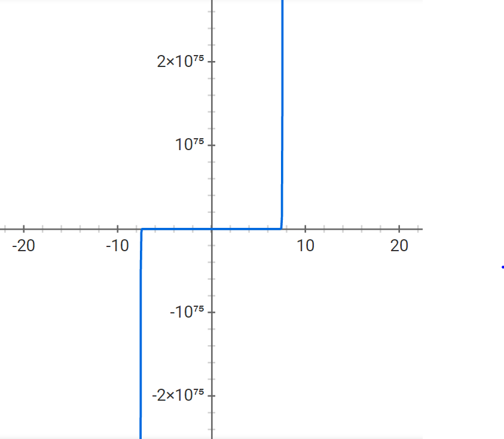

# Math 4610 Tasksheet 5

First I am going to show the image of the graph for the tasks, they used Tasksheet 4 task 4's equation, and for me to see why some of the answers were what they were, the graph was helpful.

## Task 1
Create a code that will search for a root of a function, 
f(x), using Newton's method. Use the problem defined in Tasksheet 4, Task 4 to test the code you write. Create a software manual entry and shared library addition for your Newton method routine. Include the example problem results in your software manual entry.
## Response
I was able to use the pseudo-code we discussed in class, in conjunction with a few tweaks in a few areas. I had to run the code with another function to verify it worked, and then stepped through several iterations of x0 values in the tasksheet 4 task to verify why I was getting strange results. The reason why was the graph has a very steep rate of increase to +infinity or -infinity as you move away from zero in either direction. When inputting a big enough x into the f/fderivative portion of the code, the x made the method search in the wrong direction for the root, as it sits in the saddle point. The method found the roots of a 'simpler' function with many different given inputs with no error. The answer lies in the accuracy of the inital x0. The method is shown below:
	
	public double newton(double x0, double tol, int maxIters)
    {
        //Initialize variables
        double xnew = 0.0;
        double xold = x0;
        //ensures one trip through the loop
        double error = 10.0 *tol;
        int iters = 0;

        //while error is larger than tolerance
        while(error > tol && iters < maxIters)
        {
            //increment the iteration
            iters = iters+1;
            //calculate the new value for x
            xnew = xold - (f(xold)/f2(xold));
            //update the error
            error = Math.abs(xnew - xold);
            //update the value of x
            xold = xnew;
        }
        //return the found value of the root/convergent value for the function
        return xnew;
    }
	
The results I got for x0 = 0.1
	
	Newton roots found: 0.0
	
x0 = 1.0
	
	Newton roots found: NaN
	
x0 = -1.0
	
	Newton roots found: NaN
	
x0 = -0.5
	
	Newton roots found: 0.0
	
Side Note: This same thing can happen when using Gradient Descent to find the global minima or maxima of a function. The method can get stuck in a saddle point and if the guess for some x0 is not good enough or close enough it can either: return the saddle point as the result, or it can skip the saddle point's root altogether. (I implemented a version of Gradient Descent for a graph with a min and a max in STAT 5810 and the method got stuck in the saddle point for some 'small x' but missed it for some 'large x').

## Sources
[newton Software Manual Page](https://github.com/nicoleefleming/math4610/blob/master/softwareManual/Pages/newton.md)

[newton Source Code](https://github.com/nicoleefleming/math4610/blob/master/math4610Code/src/main/java/rootFinders.java)

[graph](./graph.PNG)

## Task 2
Repeat Task 1 for the secant method. It should be easy to modify a Newton method code to implement the secant method.
## Response
I used the notes from class as a guide to write the code for the secant method. This method had no problems working correctly with the Tasksheet 4 task 4 equation to find the root of the function. Though to verify it would work for another function, I also tested it with the same function as the Newton method (x-3) to make sure it worked. The code for this mehtod is shown below:
	
	public double secant(double x0, double x1, double tol, int maxIters)
    {
        //initialize variables
        double error = 10.0 * tol;
        int iters = 0;
        //f(x) is just a function call to evaluate a given formula for a given x
        double fk = f(x0);
        double fkp1 = f(x1);
        double xk = x0;
        double xkp1 = x1;
        double xkp2 = 0.0;

        //iterate through the while loop while the error is greater than the tolerance given
        while(error > tol && iters < maxIters)
        {
            //calculate the next value of x
            xkp2 = xkp1 - ((fkp1*(xkp1-xk))/(fkp1-fk));
            //update the error
            error = Math.abs(xkp1 - xk);
            //reset the values of x to get the next value
            xk = xkp1;
            xkp1 = xkp2;
            //calculate the new function values.
            fk = fkp1;
            fkp1 = f(xkp1);
            //increment iters
            iters = iters + 1;
        }
        //return the root found/convergence value
        return xkp2;
    }
	
x0 = 1.0 , x1 = 0.5
	
	Secant roots found: 0.0	
x0 = -1.0 , x1 = -0.5
	
	Secant roots found: 0.0
	

## Sources
[secant Software Manual Page](https://github.com/nicoleefleming/math4610/blob/master/softwareManual/Pages/secant.md)

[secant Source Code](https://github.com/nicoleefleming/math4610/blob/master/math4610Code/src/main/java/rootFinders.java)

[graph](./graph.PNG)

## Task 3
Do a computational convergence analysis on Newton's method to verify quadratic convergence. Use the example defined in Tasksheet 4 to illustrate the work.
## Response
I wrote a linear regression analysis for the error Newton's method. For some reason, I have yet to get the convergence analysis to make sense. In my brain, the answer is not makning sense to me. However, I ran the code with multiple different error examples, and it seems to work. 

	myTest.erro = root.err;
        for (int i = 0; i<100; i++)
            System.out.println(myTest.erro[i]);
        //myTest.erro = myTest.getErrorLogLog(myTest.erro);
        //for (int j = 0; j<100; j++)
        //System.out.println(myTest.erro[j]);

        c = conv.linreg(myTest.erro, myTest.erro);
        System.out.println("\nThe linear regression on the secant error is: " + c[0] + ", " + c[1]);

However, using matplotlib in python, the plot also shows quadratic convergence. The graph is available upon request, as the code is being used for another class. 
## Sources
[linreg](https://github.com/nicoleefleming/math4610/blob/master/softwareManual/Pages/linreg.md)

[linreg source code](https://github.com/nicoleefleming/math4610/blob/master/math4610Code/src/main/java/convergence.java)

## Task 4
Repeat Task 3 for the secant method. (Test computational convergence)
## Response
I wrote a linear regression analysis for the error Newton's method. For some reason, I have yet to get the convergence analysis to make sense. In my brain, the answer is not makning sense to me. However, I ran the code with multiple different error examples, and it seems to work.

	myTest.erro = root.err;
        for (int i = 0; i<100; i++)
            System.out.println(myTest.erro[i]);
        //myTest.erro = myTest.getErrorLogLog(myTest.erro);
        //for (int j = 0; j<100; j++)
        //System.out.println(myTest.erro[j]);

        c = conv.linreg(myTest.erro, myTest.erro);
        System.out.println("\nThe linear regression on the newton-bisection error is: " + c[0] + ", " + c[1]);

However, using matplotlib in python, the plot also shows quadratic convergence. The graph is available upon request, as the code is being used for another class. 
## Sources
[linreg](https://github.com/nicoleefleming/math4610/blob/master/softwareManual/Pages/linreg.md)

[linreg source code](https://github.com/nicoleefleming/math4610/blob/master/math4610Code/src/main/java/convergence.java)

## Task 5
Create a hybrid method that will search for roots by combining the Bisection method when the approximations are too far from a root and then switches over to Newton's method when the approximations are close enough.
## Response
For this method, I actually looked into which hybrid method would be more beneficial for a broader array of topics. I found that the convergence of Newton's method made it the candidate that most people (on the internet) suggested. I wrote the hybridN function to be a combination of bisection and Newton's method because of this. If I were to alter it in need of a secant-bisection hybrid, I have notes of how I can alter the function below to yield that method. For this task it was requested to be a hybrid of the bisection-Newton, but I wanted to see which was more widely used. This method was effective and efficient for finding one root in the functions I tested it with. The method could still be used in a multi-root finding setting where the changes are made before calling this method. 
The code for the Hybrid-Bisection/Newton method is shown below:

	public double hybridN(double a, double b, double tol, int maxIters)
    {
        //check if [a,b] is valid
        double tmp;
        if (a>b)
        {
            tmp = b;
            b = a;
            a = tmp;
        }

        //initialize other variables
        int iters = 0;
        double error = 10.0 * tol;
        double fa = f(a);
        double fb = f(b);
        double fc;
        double c = 0.0;
        double xnew = 0.0;

        //check other cases that could happen
        if (fa * fb > 0)
        {
            System.out.println("Error");
            return 0.0;
        }
        if (fa == 0)
        {
            return a;
        }
        if(fb == 0)
        {
            return b;
        }

        //initialize errorb and errorn
        double errorb = error;
        double errorn = error;

        //loop thorugh based on error staying larger than the tolerance. Then return c.
        while(error > tol && iters < maxIters)
        {
            c = 0.5 * (a+b);
            xnew = c - (f(c)/f2(c));

            //first Newton Error
            errorn = Math.abs(xnew - c);

            //check if Newton's method may fail
            if(errorn > Math.abs(b-a))
            {
                //Bisection section
                for (int i = 0; i < 4; i++) {
                    fc = f(c);
                    if (fa * fc == 0) {
                        b = c;
                        fb = fc;
                    } else {
                        a = c;
                        fa = fc;
                    }
                    c = 0.5 * (a + b);
                    errorb = Math.abs(b - a);
                }
            }
            error = errorb;
            iters = iters + 1;
        }
        return c;
    }

The results with the inputs a = -1.0, b = 1, tol = 0.000001, and maxIters = 100 -- I also tested with a = -10 and b = 10 and got the same result with tasksheet 4 task 4 function

	The hybrid root found using bisection and Newton's method is: 0.0	
	
## Sources
[hybridN Software Manual Page](https://github.com/nicoleefleming/math4610/blob/master/softwareManual/Pages/hybridN.md)

[hybridN Source Code](https://github.com/nicoleefleming/math4610/blob/master/math4610Code/src/main/java/rootFinders.java)

[graph](./graph.PNG)
## Task 6
 Search the internet for sites that detail differences between the Bisection method, Newton's method, and the Secant method. Write a brief summary of what you find including the pros and cons of the methods. Your write up should be a brief paragraph (3 or 4 sentences) that describe your findings. Include links to the sites you cite.
## Response
The Bisection method is always convergent, but has a slow convergence rate. The Newton Method is expensive with computations since it requires the function and the derivative, but it might never converge if the tangent line to the function is near parallel. Newton's method does ensure quadratic convergence when it converges, adn it has the fastest convergence rate. The Secant method only requires one function evaluation each iteration compared to Newton's two.  
## Sources
[Bisection advantages/disadvantages](https://www.cbpbu.ac.in/userfiles/file/2020/STUDY_MAT/PHYSICS/NP%202.pdf)

[Newton advantages/disadvantages](http://epoch.uwaterloo.ca/syde312/open_methods/page3.htm)

[Secant advantages/disadvantages](http://studyhelpszone.blogspot.com/2009/07/advantages-and-disadvanteges-of-secant.html)

[Secant pros/cons](https://www.lehigh.edu/~ineng2/clipper/notes/secant.htm)

