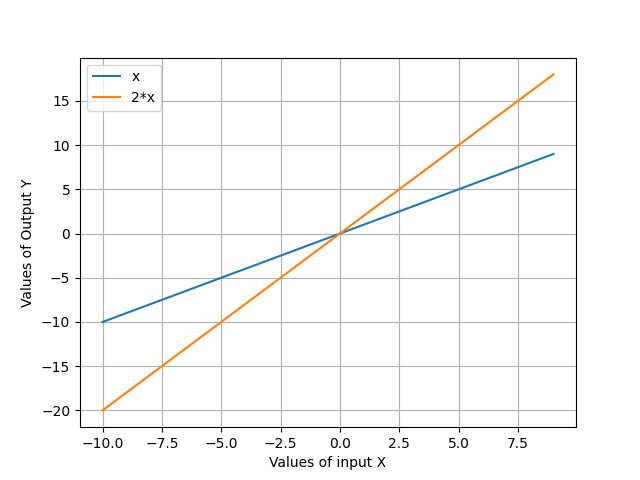

# Math 4610 Numerical Methods

**Routine Name:**           plotMany

**Author:** Nicole Fleming

**Language:** Python. The code can be compiled using the commandline. I also ran it 

For example,

    commandline: ./plotMany.py
                 or
                 plotMany.py

will produce in running the program in both sources. 

**Description/Purpose:** This routine will compute the  log-log plot for f(x) = cos(2.0) with the approximations of f(x) at given values of h.

**Input:** There are no inputs. This method is called and will show the plot generated.
 

**Output:** This routine shows a plot of many functions of x. 

**Usage/Example:**

The routine is a script that is run with no inputs, and will have an output is a plot like this

**Implementation/Code:** The following is the code for plotMany

    import matplotlib.pyplot as mpl
    import numpy as np

    def plot2D(*args):
       mpl.grid(1)
       xAxis = np.arange(args[1],args[2],args[3])

    def xfunction(x,input):
        return eval(input)
    print(xfunction(5,args[0]))
    mpl.plot(xAxis, xfunction(xAxis, args[0]), label=args[0])
    mpl.xlabel("Values of input X")
    mpl.ylabel("Values of Output Y")

    # creating an empty list
    lst = []

    # number of elemetns as input
    n = int(input("Enter number of elements : "))

    # iterating till the range
    for i in range(0, n):
        ele = str(input())
        lst.append(ele)  # adding the element
    print(lst)

    n = len(lst)

    for a in range(0, n):
        i = a
        plot2D(lst[i], -10, 10, 1)
    mpl.legend(loc="upper left")
    mpl.show()

**Last Modified:** 18/October/2020
